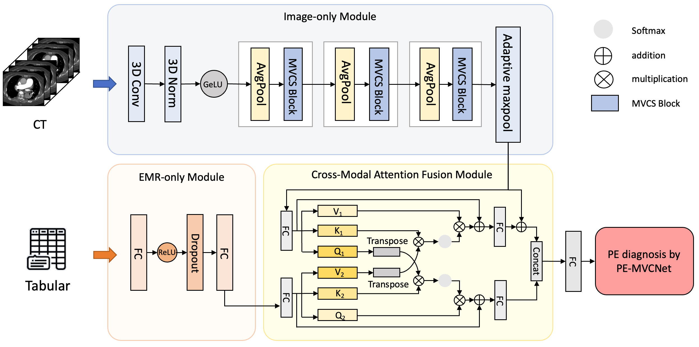

# PE-MVCNET: MULTI-VIEW AND CROSS-MODAL FUSION NETWORK FOR PULMONARY EMBOLISM PREDICTION


### Our paper has been accepted by ISBI 2024!
## Proposed method
We spend a lot of time collecting and summarizing relevant papers and datasets, where you can find them at https://github.com/Ivygugu/Pulmonary-Embolism-Detection/blob/main/README.md

This code is a pytorch implementation of our paper "PE-MVCNET: MULTI-VIEW AND CROSS-MODAL FUSION NETWORK FOR PULMONARY EMBOLISM PREDICTION".

 Our method comprises the Image-only module with an integrated multi-view block, the EMR-only module, and the Cross-modal Attention Fusion (CMAF) module. These modules cooperate to extract comprehensive features that subsequently generate predictions for PE. The figure below shows our proposed network.




 ## The Multi-View Coupled Self-Attention Block of our method


 ## Experiment result
   We compared to other state-of-the-art methods and our results are better than any other method of comparison. Results prove that the introduced CMAF module adeptly captures the inherent correlations between the two modalities, thereby providing the model with richer information.
<table>
<thead>
  <tr>
    <th>Methods</th>
    <th>AUROC</th>
    <th>ACC</th>
    <th>F1 score</th>
    <th>Specificity</th>
    <th>Sensitivity</th>
    <th>PPV</th>
    <th>NPV</th>
  </tr>
</thead>
<tbody>
  <tr>
    <td>3D ResNet50</td>
    <td>0.694</td>
    <td>0.556</td>
    <td>0.687</td>
    <td>0.785</td>
    <td>0.963</td>
    <td>0.534</td>
    <td>0.785</td>
  </tr>
  <tr>
    <td>3D ResNet101</td>
    <td>0.722</td>
    <td>0.611</td>
    <td>0.701</td>
    <td>0.757</td>
    <td>0.902</td>
    <td>0.574</td>
    <td>0.757</td>
  </tr>
  <tr>
    <td>PENet</td>
    <td>0.660</td>
    <td>0.623</td>
    <td>0.666</td>
    <td>0.656</td>
    <td>0.743</td>
    <td>0.604</td>
    <td>0.656</td>
  </tr>
  <tr>
    <td>PEfusion</td>
    <td>0.936</td>
    <td>0.882</td>
    <td>0.882</td>
    <td>0.900</td>
    <td>0.866</td>
    <td>0.898</td>
    <td>0.867</td>
  </tr>
  <tr>
    <td>PE-MVCNet(Ours)</td>
    <td>0.941</td>
    <td>0.902</td>
    <td>0.906</td>
    <td>0.932</td>
    <td>0.939</td>
    <td>0.899</td>
    <td>0.932</td>
  </tr>
</tbody>
</table>

## Pre-requisties
* Linux

* Python>=3.7

* NVIDIA GPU (memory>=23G) + CUDA cuDNN

## Getting started to evaluate
### Install dependencies
```
pip install -r requirements.txt
```
### Download the checkpoint
Our model's best checkpoint can be found in the following link : 

checkpoint的链接

### Evaluation
To do the evaluation process, please run the following command :
```
sh test.sh
```

### Train by yourself
If you want to train by yourself, you can run these command :
```
sh train.sh
```

### Data
The image data we used is from Stanford University Medical Center dataset. You can follow this link to download it.

Stanford数据集链接

And tabular data is already provided in this github.
